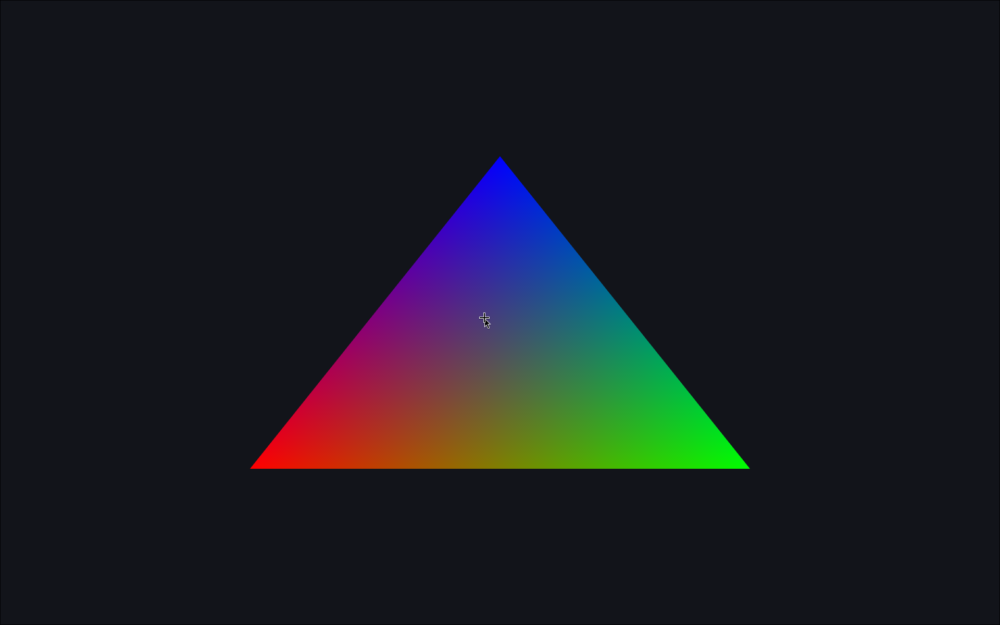

# wasm-triangle
Basic WASM Triangle with WebGL (using C). Opening `index.html` in your preferred browser will display a basic colorful triangle. This project serves as a basic template to get started with WASM and WebGL, and can be extended for other porting video games or just about any native desktop application in general.

## Files

+ `index.html`: Contains a basic HTML skeleton with a `<canvas>` and a `<script>` to get the gears running.
+ `main.js`: Obtains WebGL2 context and is responsible for loading `main.wasm` along with calling `Init()`, `Resize()` and `Frame()`
+ `main.c`: Main C file containing rendering code
+ `main.wasm`: WASM module compiled from `main.c`

## Building

You will need a recent version of `clang` with `wasm32` target to compile `main.c` to `main.wasm`.

```
clang \
    --target=wasm32 \
    -O3 \
    -nostdlib \
    -Wl,--no-entry \
    -Wl,--export-all \
    -Wl,--export-memory \
    -Wl,--initial-memory=1048576 \
    -Wl,--max-memory=16777216 \
    -Wl,--export-table \
    -Wl,--allow-undefined \
    -o main.wasm \
    main.c
```

## Screenshot



